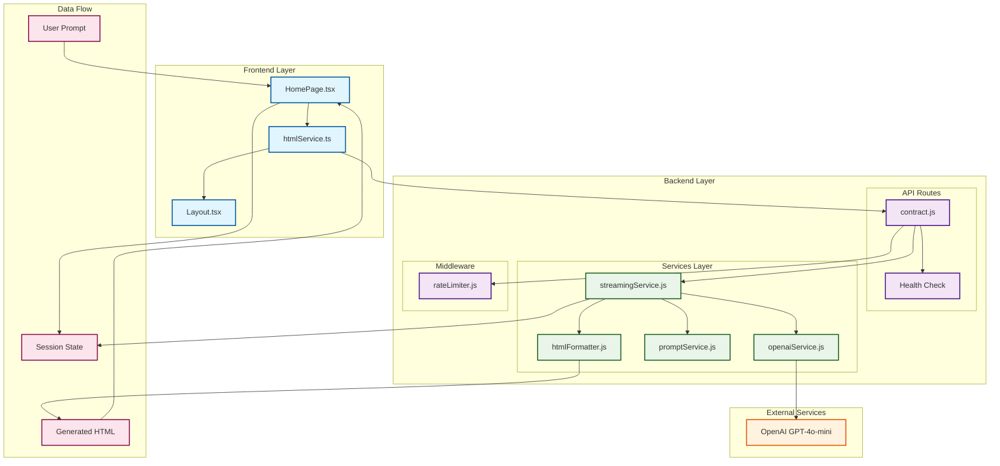
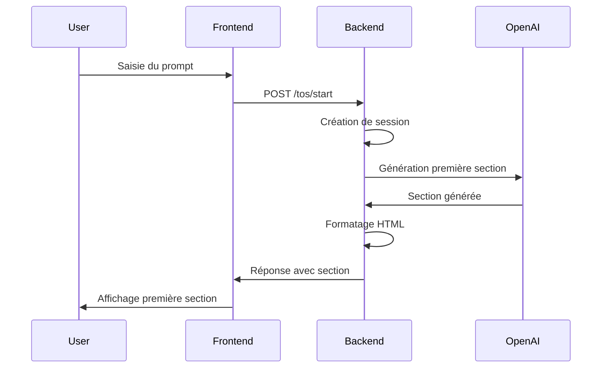
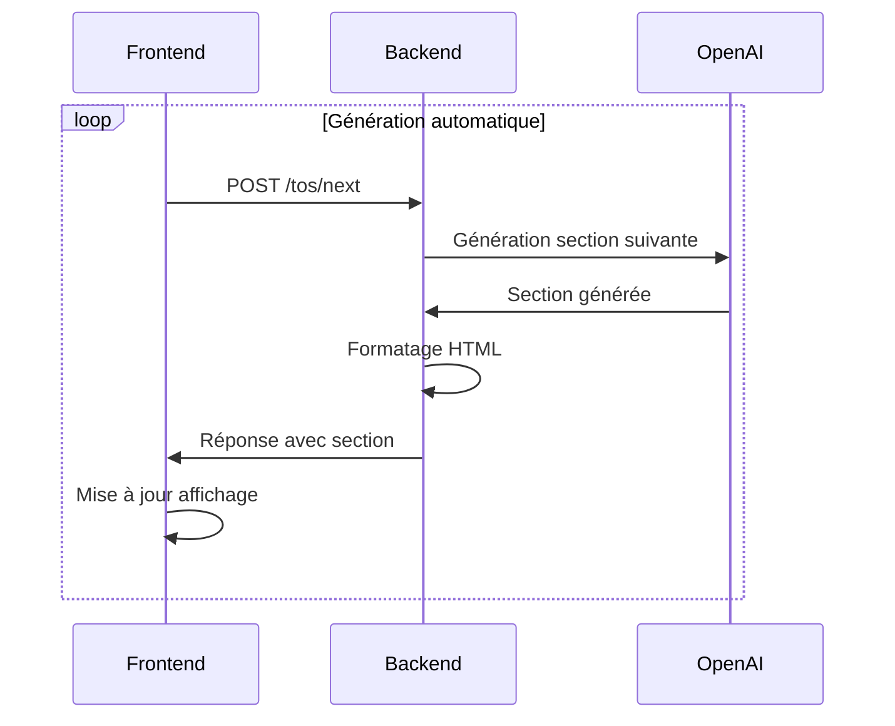
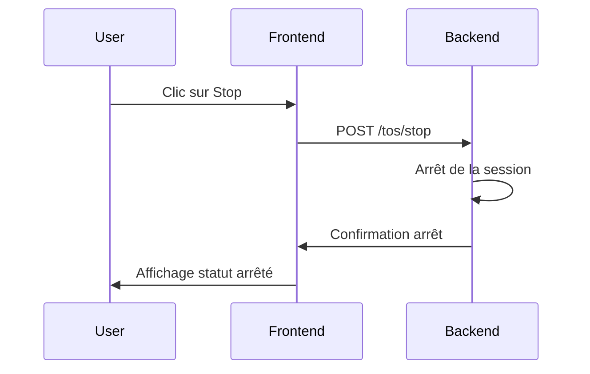

# Architecture Détaillée - Contract Generator AI

## 🏗️ Diagramme d'Architecture Complet



## 🔄 Flux de Données Détaillé

### 1. **Démarrage de la Génération**


### 2. **Génération des Sections Suivantes**


### 3. **Arrêt de la Génération**


## 🎯 Responsabilités Détaillées

### **Frontend (React + TypeScript)**

#### HomePage.tsx
- **État Local** : Gestion du prompt, statut de génération, sections générées
- **Logique Métier** : Orchestration de la génération automatique
- **Interface Utilisateur** : Formulaires, boutons, affichage des sections
- **Gestion des Erreurs** : Affichage des erreurs et messages de statut

#### htmlService.ts
- **Client HTTP** : Appels aux endpoints backend
- **Typage** : Interfaces TypeScript pour les réponses API
- **Gestion des Erreurs** : Transformation des erreurs HTTP

### **Backend (Node.js + Express)**

#### streamingService.js - Orchestrateur Principal
```javascript
// Responsabilités clés
class ToSStreamingService {
  // 1. Gestion des sessions
  activeSessions: Map<string, Session>
  
  // 2. Orchestration de la génération
  startGeneration(userPrompt, sessionId)
  generateNextSection(sessionId)
  stopGeneration(sessionId)
  
  // 3. Nettoyage automatique
  cleanupExpiredSessions(maxAgeHours)
}
```

#### openaiService.js - Interface OpenAI
```javascript
// Responsabilités clés
- Communication avec l'API OpenAI
- Validation des réponses avec Zod
- Gestion des erreurs d'API
- Optimisation des tokens
```

#### promptService.js - Générateur de Prompts
```javascript
// Responsabilités clés
- Génération de prompts structurés
- Optimisation des tokens
- Formatage JSON requis
- Gestion des sections multiples
```

#### htmlFormatter.js - Formateur HTML
```javascript
// Responsabilités clés
- Conversion des sections en HTML
- Gestion des sous-sections
- Formatage des listes numérotées
- Structure HTML cohérente
```

## 🔧 Points Techniques Clés

### 1. **Gestion des Sessions**
- Sessions stockées en mémoire (Map)
- Nettoyage automatique toutes les heures
- Statut persistant pendant la génération

### 2. **Génération Séquentielle**
- Sections générées une par une
- Contrôle de la progression
- Possibilité d'arrêt à tout moment

### 3. **Optimisation des Coûts**
- Utilisation de GPT-4o-mini (moins cher)
- Prompts optimisés pour réduire les tokens
- Validation des réponses pour éviter les régénérations

### 4. **Sécurité**
- Rate limiting sur tous les endpoints
- Validation des entrées
- Sanitisation HTML avec DOMPurify

## 📊 Métriques de Performance

### **Backend**
- Temps de réponse API : < 200ms
- Gestion de sessions : Jusqu'à 1000 sessions simultanées
- Nettoyage automatique : Toutes les heures

### **Frontend**
- Temps de rendu : < 100ms
- Mise à jour en temps réel : 300ms entre sections
- Interface responsive : Mobile-first design

## 🚀 Évolutions Futures

### **Court Terme**
- Cache Redis pour les sessions
- Logs structurés
- Métriques de performance

### **Moyen Terme**
- Support multi-langues
- Templates de contrats
- Export PDF

### **Long Terme**
- IA spécialisée par domaine juridique
- Validation légale automatisée
- Intégration avec des bases de données juridiques 