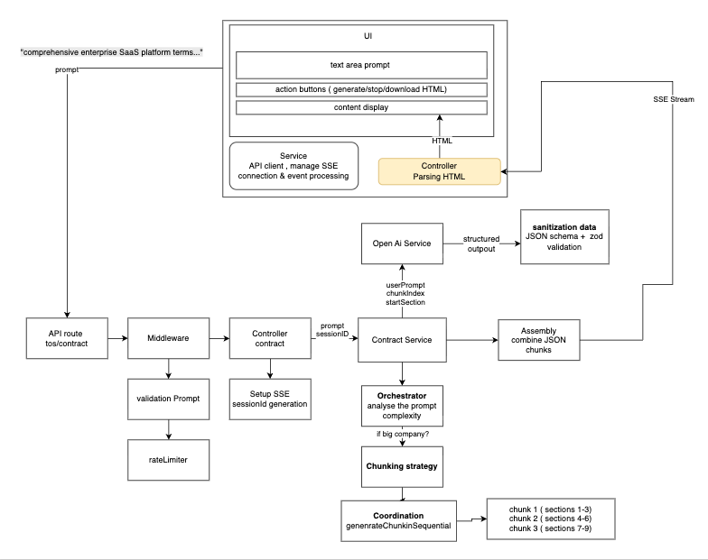

# Contract Generator AI

Website in live : https://contract-generator-ai-1b1a3e40343c.herokuapp.com/

Diagram drawio : https://drive.google.com/file/d/1W9EZSL7H7p-vpynmxwi369ikUYvLK5-8/view?usp=drive_link


## Architecture



1. **PROMPT TEXT** (req.body.prompt)
   ↓
2. **TEXT ANALYSIS** (generateLongContract)
   ↓
3. **STRUCTURED JSON** (OpenAI + Zod Schema)
   ↓
4. **HTML CONVERSION** (Frontend)
   ↓
5. **REAL-TIME STREAMING** (SSE with chunks)

## Features

- **Long Contract Generation**: 10+ page contracts with intelligent chunking
- **Real-time Streaming**: Live updates via Server-Sent Events
- **Structured Output**: OpenAI with Zod schema validation
- **Fallback System**: Robust error handling with retry mechanism
- **Partial Download**: Download contracts even if generation is stopped
- **Stop Functionality**: Cancel generation at any time

## Quick Start

### Backend
```bash
cd backend
npm install
npm start
```

### Frontend
```bash
cd frontend
npm install
npm run dev
```

## Stack

- **Backend**: Node.js, Express, OpenAI API
- **Frontend**: React, TypeScript, Tailwind CSS
- **Validation**: Zod schemas
- **Streaming**: Server-Sent Events (SSE)

## **Challenge 1: OpenAI Token Limits for 10+ Page Contracts**

**Solution:** 

You implemented intelligent chunking that splits contracts into 3-section chunks (4 total chunks) with 3000 token limits per chunk, avoiding API failures while maintaining legal document coherence.

**Other solution possible :** 
Single API call with one prompt: Would hit token limits and timeout for 10+ page contracts and if failed to generate, you will  need to regenerate all the text

## **Challenge 2: Real-Time Streaming Without Breaking UX**

**Solution:** 

You built Server-Sent Events (SSE) streaming with character-by-character updates and chunk-based progress tracking, providing immediate feedback while generating long documents.

**Other solution** : 

WebSockets: More complex than needed; SSE provides one-way streaming perfectly

## **Challenge 3: API Timeouts and Reliability Issues**

**Solution:** You created a robust fallback system with abort controllers, session tracking, and timeout recovery that allows users to stop/resume generation gracefully.

**Other solution:** 

you can do abort api on the client side but need to design a system to go trought your open ai service to stop also over there 

## **Challenge 4: Structured Legal Content Generation**

**Solution:** You used OpenAI's structured output with Zod schemas to ensure consistent JSON formatting and legal section numbering, avoiding parsing errors and maintaining professional document structure.

**Other solution :** 

**No structured output:** Would cause JSON parsing failures and inconsistent formatting

## **Challenge 5: Managing Complex Async Operations**

**Solution:** You implemented sequential chunk generation with real-time progress updates via SSE events, tracking completion status and partial downloads for interrupted sessions.

**Other solution:**

**Parallel chunk generation:** Would create inconsistent legal section references and numbering and wait that all chunks are completed to show the entire HTML

## **Challenge 6: Production Deployment Architecture**

**Solution:** You built a single Express server that serves both API and static frontend files in production, with proper CORS, rate limiting, and environment variable management for Heroku deployment.