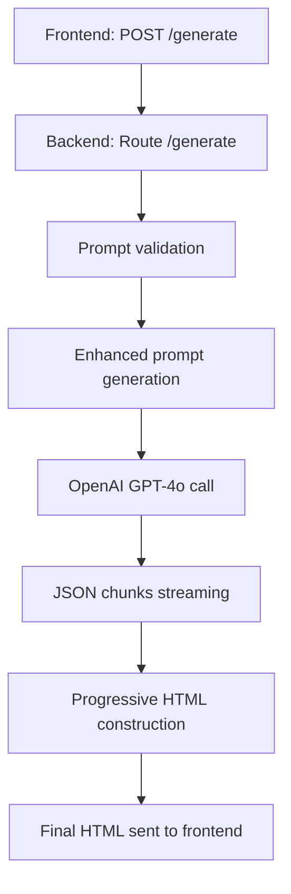

# 🔄 Backend Flow Diagram - Contract Generator

## 📋 Process Overview



## 🎯 Step Details

### 1. **Request Reception**
```
INPUT: { "prompt": "Draft terms of service for SaaS company" }
OUTPUT: Prompt validation
```

### 2. **Prompt Enhancement**
```
INPUT: Simple user prompt
OUTPUT: Enhanced prompt with detailed legal instructions
```

### 3. **OpenAI API Call**
```
INPUT: Enhanced prompt + System prompt (senior legal expert)
OUTPUT: Stream of structured JSON chunks
```

### 4. **OpenAI Chunks Format**
```json
{
  "n": 1,                    // Section number
  "t": "Def",                // Compact title
  "ss": [                    // Subsections
    {
      "n": "1.1",            // Subsection number
      "t": "Scope",          // Subsection title
      "c": "Legal content...", // Legal content
      "l": ["(i) item", "(ii) item"] // Numbered list
    }
  ]
}
```

### 5. **Progressive HTML Construction**

#### **Step 1: HTML Header + CSS**
```html
<!DOCTYPE html>
<html>
<head>
  <style>
    /* Complete CSS for contract */
  </style>
</head>
<body>
  <div class="status-indicator">Generating...</div>
  <div class="contract-container">
    <div class="contract-header">
      <h1>TERMS OF SERVICE AGREEMENT</h1>
      <!-- Meta and intro -->
    </div>
    <div id="contract-content">
```

#### **Step 2: Contract Content**
```html
<div class="section">
  <h2 class="section-title">1. Definitions</h2>
  <h3 class="subsection-title">1.1 Scope</h3>
  <p class="content">Legal content...</p>
  <ol class="numbered-list">
    <li class="list-item">Item 1</li>
  </ol>
</div>
```

#### **Step 3: HTML Footer**
```html
    </div>
    <div class="contract-footer">
      <!-- Legal footer -->
    </div>
  </div>
  <script>
    // Status update
  </script>
</body>
</html>
```

## 🔄 Streaming Flow

### **SSE Messages Sequence:**

1. **Header** → `progress: "header"`
   ```
   html_chunk: <!DOCTYPE html>...
   ```

2. **Content** → `progress: "content"`
   ```
   html_chunk: <div class="section">...
   ```

3. **Footer** → `progress: "complete"`
   ```
   html_chunk: </div></body></html>
   html: [Complete assembled HTML]
   ```

## 📊 Data Structure

### **Input Frontend → Backend:**
```typescript
interface ContractRequest {
  prompt: string;
}
```

### **Output Backend → Frontend:**
```typescript
interface GenerationStatus {
  status: 'idle' | 'generating' | 'completed' | 'error' | 'stopped';
  message?: string;
  html?: string;           // Complete final HTML
  error?: string;
  streamingContent?: string; // Raw content (optional)
}
```

### **SSE Messages:**
```typescript
interface SSEMessage {
  html_chunk: string;      // HTML chunk or "COMPLETE"
  progress: string;        // "header" | "content" | "complete" | "failed"
  section: string;         // "template" | "contract" | "footer" | "error"
  timestamp: string;
  html?: string;           // Complete HTML (only at the end)
  error?: string;          // Error message if applicable
}
```

## 🎨 Architecture Benefits

### ✅ **Backend responsible:**
- Structured HTML generation
- Integrated and optimized CSS
- Data validation
- Error handling

### ✅ **Frontend simplified:**
- Direct HTML reception
- Immediate display
- Simple download
- No client-side formatting

### ✅ **Smart streaming:**
- HTML template first
- Progressive content
- Complete final HTML
- State management

## 🚀 Final Result

The frontend receives a complete HTML file with:
- ✅ **Valid HTML5** structure
- ✅ **Integrated CSS** and responsive
- ✅ **Formatted legal** content
- ✅ **Professional** layout
- ✅ **Ready for immediate** download 